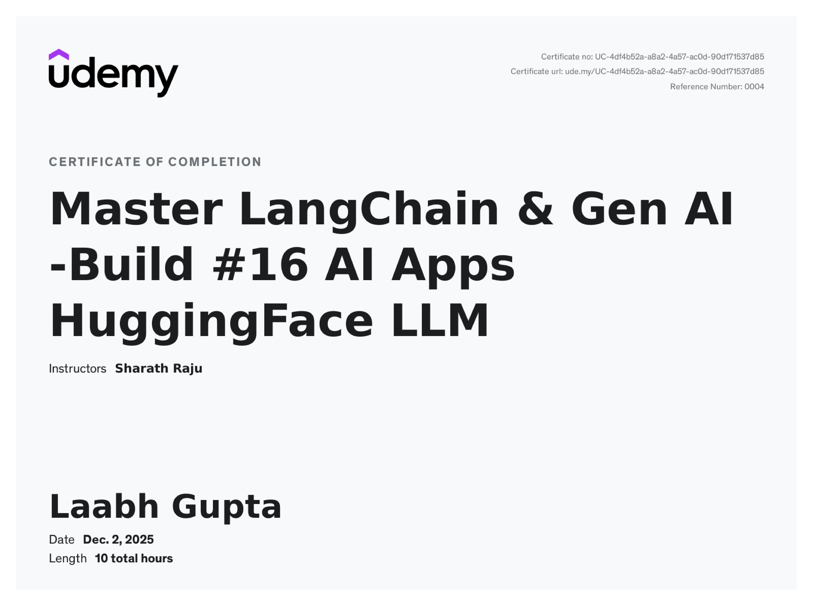
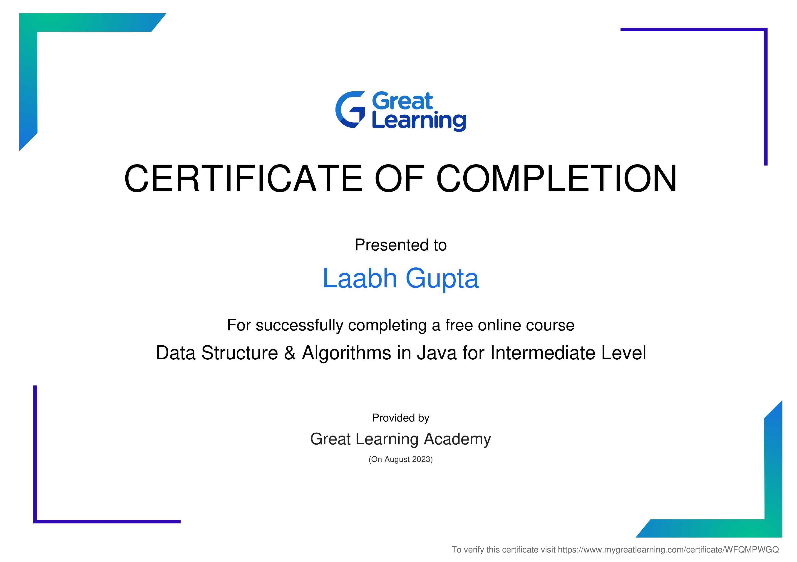

# 📜 Certifications & Learnings Portfolio

This repository section highlights the certifications I have completed across LLM/GenAI, full‑stack web development, and core Data Structures & Algorithms (Java).  
Each certification includes:

- **About the course**  
- **My learnings**  
- **The certificate itself**  

You may store all certificate images inside a folder named:
```
/certificates
```

---

## 🧠 1. Master LangChain & Gen AI — Build LLM & GenAI Apps (Udemy)

**Course Link:** https://www.udemy.com/share/10996g3@mf0kMZAq6asUN08eq9Kgfvi_jtfmPCPiYcyJTWd9hJ1xCZqVmCJxyAu-4ng097kyvQ==/

### 📘 About the Course
A hands‑on, application-driven Generative AI course focused on **LangChain**, **LLMs**, **Hugging Face**, **Vector Databases**, and end‑to‑end AI app development.  
It teaches how to integrate LLMs into real applications, build RAG systems, use embeddings, prompt engineering, document loaders, memory systems, and build complete AI tools with modern frameworks.

### 🎯 What I Learned
- Concepts of **transformers**, LLM internals, tokenization & embeddings  
- Building **RAG (Retrieval-Augmented Generation)** systems  
- Using **LangChain**: chains, agents, memory, prompt templates, tools  
- Working with **HuggingFace models** for NLP tasks  
- Creating **production‑style AI apps** (chatbots, document-QA, summarizers)  
- Using **vector databases** such as Pinecone/FAISS  
- Deploying AI apps using **Streamlit**  
- Building over **16 practical LLM projects**

### 🏆 Certificate


---

## 🌐 2. The Complete Full‑Stack Web Development Bootcamp (Udemy)

**Course Link:** https://www.udemy.com/share/101qYw3@fiHHBcWiYD0cRXWA4bMgPAScAPyOUv4CvmLRMMThTwDhpcFjHkI1pORjlXCcqgUBFQ==/

### 📘 About the Course
A comprehensive full‑stack development program covering everything needed to build and deploy modern web applications.  
This includes both **frontend** and **backend development**, databases, best practices, and real‑world application architecture.

### 🎯 What I Learned
- **Frontend development**: HTML, CSS, JavaScript, responsive UI design  
- **Backend development**: server design, routing, REST APIs, authentication  
- Working with **databases** (SQL / NoSQL)  
- Full‑stack concepts: connecting frontend ↔ backend, MVC patterns  
- Using tools like Node.js, Express, and other backend frameworks  
- Deployment workflows and Git/GitHub version control  
- Building complete and scalable web applications

### 🏆 Certificate


---

## ☕ 3. Data Structures & Algorithms in Java (Great Learning)

**Course Link:**  
https://www.mygreatlearning.com/academy/learn-for-free/courses/data-structures-and-algorithms-in-java?referrer_code=GLXD3YRYTFXJG

### 📘 About the Course
A structured and beginner-to-intermediate level course on **data structures**, **algorithms**, and computational thinking using Java.  
This course helps strengthen problem‑solving abilities and lays the foundation for technical interviews.

### 🎯 What I Learned
- Implementing core data structures: arrays, linked lists, stacks, queues  
- Working with trees, BSTs, heaps, and priority queues  
- Algorithmic fundamentals: sorting, searching, recursion  
- Big‑O complexity analysis  
- Hash maps, sets, and hashing  
- How to write optimized Java code  
- Applying DSA concepts in real coding problems

### 🏆 Certificate

