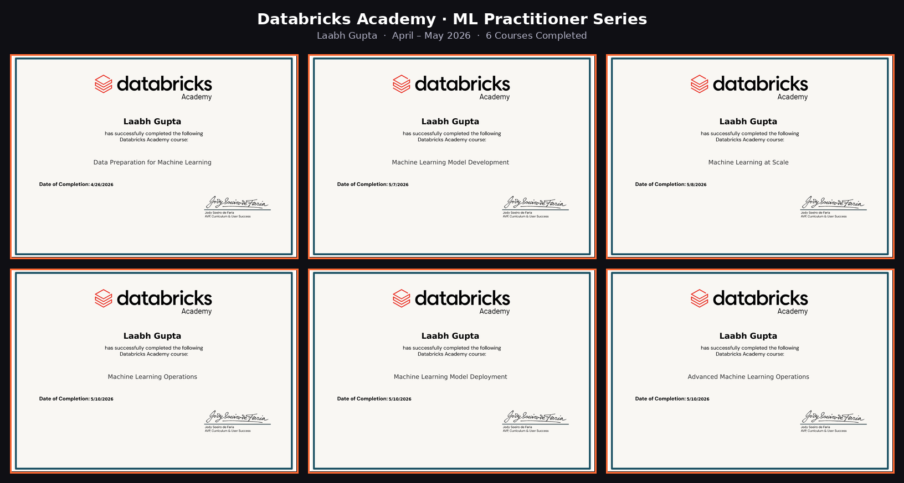
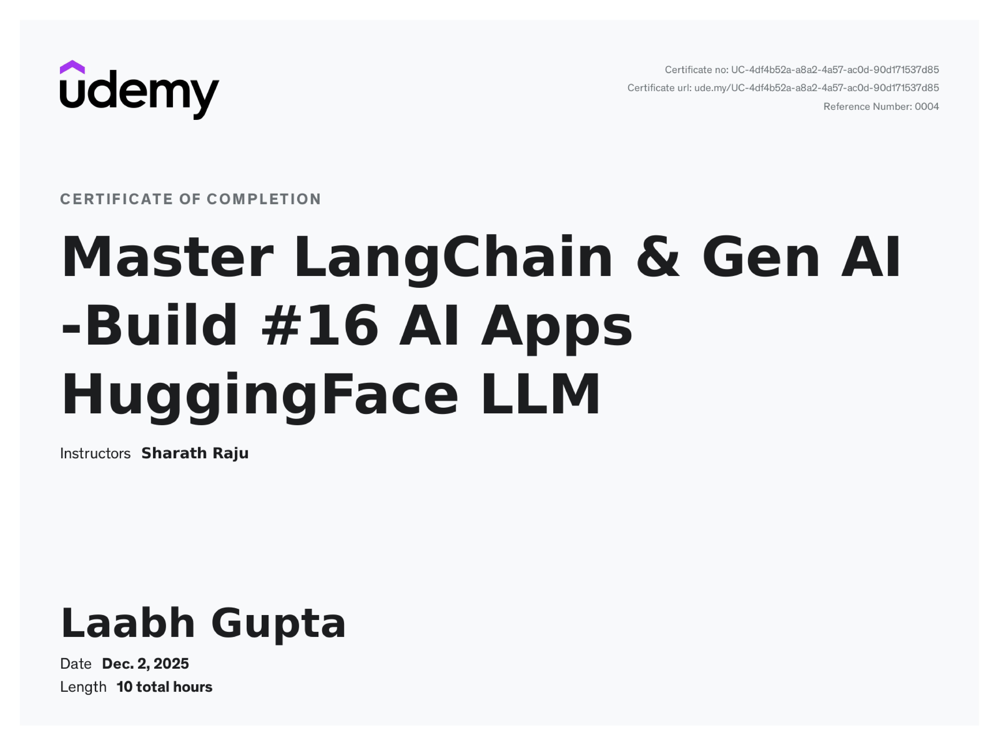
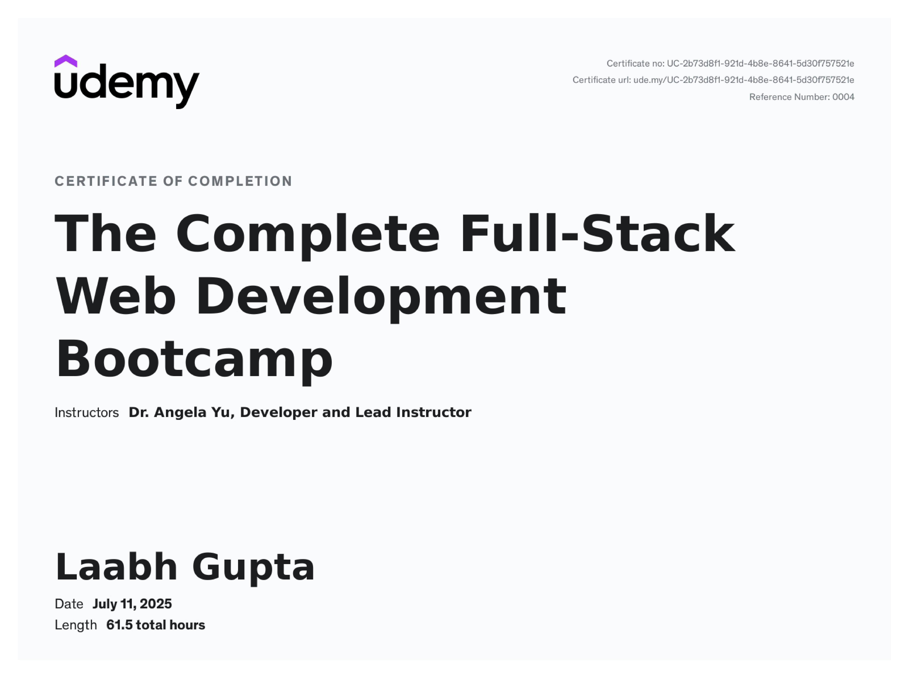
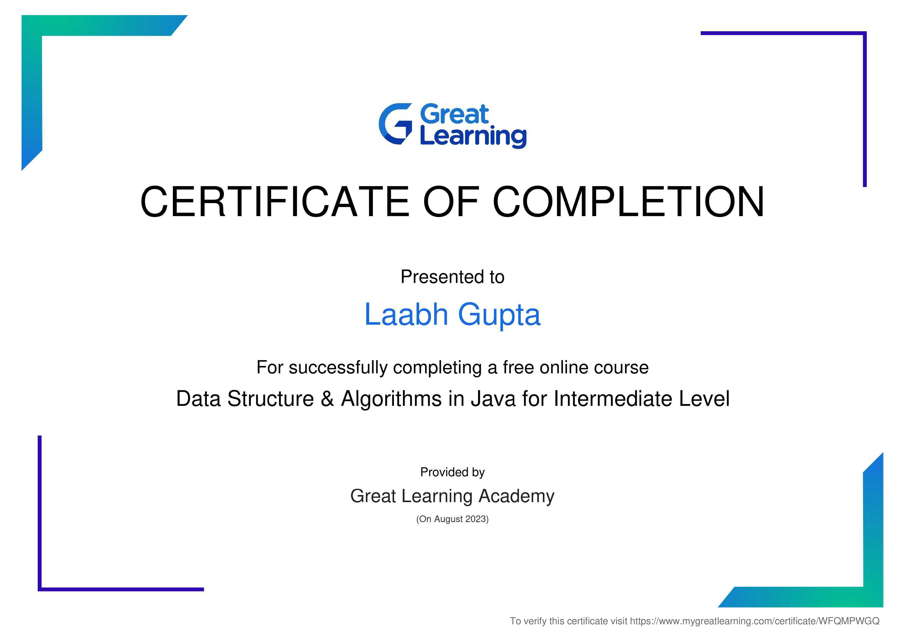

# 📜 Certifications & Learnings Portfolio

This repository section highlights the certifications I have completed across LLM/GenAI, full‑stack web development, and core Data Structures & Algorithms (Java).  
Each certification includes:

- **About the course**  
- **My learnings**  
- **The certificate itself**  

You may store all certificate images inside a folder named:
```
/certificates
```

## 🔶 1. Databricks Academy — Machine Learning Practitioner Series

**Platform:** [Databricks Academy](https://customer-academy.databricks.com)

### 📘 About the Course

A hands-on series of 6 courses from Databricks Academy covering the full machine learning lifecycle on the Databricks Lakehouse Platform — from raw data preparation through model development, scaled training, deployment, and production-grade MLOps.

### 🎯 What I Learned

- **Data Preparation** — Feature engineering, handling imbalanced data, and preparing datasets for ML using Spark and Delta Tables
- **Model Development** — Training and evaluating models with MLflow tracking, experiment management, and model registry
- **ML at Scale** — Distributed training with Apache Spark MLlib and Hyperopt for hyperparameter tuning across clusters
- **ML Operations** — Building end-to-end ML pipelines, model versioning, and automating retraining workflows
- **Model Deployment** — Serving models via REST endpoints, batch inference, and real-time scoring on Databricks
- **Advanced MLOps** — CI/CD for ML, monitoring model drift, governance, and production reliability practices

### 🏆 Certificates



| Course | Completed |
|--------|-----------|
| Data Preparation for Machine Learning | Apr 26, 2026 |
| Machine Learning Model Development | May 7, 2026 |
| Machine Learning at Scale | May 8, 2026 |
| Machine Learning Operations | May 10, 2026 |
| Machine Learning Model Deployment | May 10, 2026 |
| Advanced Machine Learning Operations | May 10, 2026 |

---

## 🧠 2. Master LangChain & Gen AI — Build LLM & GenAI Apps (Udemy)


**Course Link:**  
https://www.udemy.com/share/10996g3@mf0kMZAq6asUN08eq9Kgfvi_jtfmPCPiYcyJTWd9hJ1xCZqVmCJxyAu-4ng097kyvQ==/

### 📘 About the Course
A comprehensive, beginner-friendly to advanced course designed to help developers build powerful **LLM-powered applications** using **LangChain**, **OpenAI**, **Hugging Face**, **LLAMA 2**, **Pinecone**, and **Google Gemini Pro**.  
The curriculum covers everything from the fundamentals of LLMs to building practical GenAI solutions that integrate external data sources, vector databases, and advanced prompt workflows.

The course combines clear explanations with hands-on learning, making it ideal for aspiring AI developers who want to move beyond rule-based systems and build real, scalable AI applications.

### 🎯 What I Learned
- **LLM Foundations**  
  - How modern LLMs work (OpenAI, Gemini, LLAMA 2, Hugging Face models)  
  - Tokenization, embeddings, and language model reasoning  

- **LangChain Core Concepts**  
  - LLMs, Chat Models, Prompt Templates  
  - Indexes & Document Loaders  
  - Memory systems and conversational pipelines  
  - Chains & Agents for multi-step task automation  

- **Vector Databases & Retrieval**  
  - Using Pinecone to store and retrieve embeddings  
  - Building Retrieval-Augmented Generation (RAG) systems  
  - Connecting LLMs with external knowledge sources  

- **Prompt Engineering & Structured Outputs**  
  - Designing effective prompts  
  - Building controlled, consistent model responses  
  - Output parsing and response validation  

- **Practical GenAI Development**  
  - How to integrate OpenAI, Hugging Face, Google Gemini Pro  
  - Creating production-like applications using Python  
  - Streamlit interfaces for interactive AI apps  
  - Best practices for scalable LLM app development  
### 🧩 Projects
Throughout the course, I built **multiple real-world GenAI applications**, applying LangChain and LLMs to practical use-cases such as:  
- conversational agents  
- document/question answering  
- summarization  
- content generation  
- data analysis  
- workflow automation  

➡️ **All the projects I built during this course can be viewed here:**  
🔗 **https://github.com/Laabh-Gupta/llm-genai-practice-projects**

### 🏆 Certificate


---

## 🌐 3. The Complete Full‑Stack Web Development Bootcamp (Udemy)

**Course Link:**  
https://www.udemy.com/share/101qYw3@fiHHBcWiYD0cRXWA4bMgPAScAPyOUv4CvmLRMMThTwDhpcFjHkI1pORjlXCcqgUBFQ==/

### 📘 About the Course
This is one of the **highest-rated and most comprehensive full-stack web development bootcamps** on Udemy, taught by Angela Yu from the App Brewery.  
The course contains over **62 hours** of content and takes you from **absolute beginner to full-stack developer**, covering everything from frontend foundations to backend development, databases, deployment, Git, Web3 and even React.

It includes 32+ real-world projects, animated explanations, coding challenges, and end-to-end application building.  
The curriculum is updated to be **2024 ready** and covers the same content taught in their in-person London bootcamp.

### 🎯 What I Learned
- **Frontend Development**
  - HTML5, CSS3, Flexbox, Grid, Bootstrap 5  
  - JavaScript ES6, DOM Manipulation, jQuery  
  - Responsive layouts & UI fundamentals  
  - Git, GitHub & version control  

- **Backend Development**
  - Node.js, NPM, Express.js, EJS  
  - REST APIs & server-side logic  
  - Authentication, sessions, security practices  

- **Databases**
  - SQL & PostgreSQL  
  - Database design, CRUD operations  

- **React**
  - React.js fundamentals  
  - JSX, Components, Props, State  
  - **React Hooks** (useState, useEffect, useContext, etc.)  
  - Building interactive, scalable frontend applications  

- **Advanced Topics**
  - Deployment (GitHub Pages and other methods)  
  - Web Design fundamentals  
  - Bash & command-line workflows  
  - Web3 foundations: Blockchain basics, Token contracts, NFT logic  
  - Professional developer best-practices  

- **Projects**
  - Built 32+ real-world websites & applications  
  - Hands-on coding exercises, quizzes, and challenges  
  - End-to-end full-stack applications  

### 🏆 Certificate


---

## ☕ 4. Data Structures & Algorithms in Java (Great Learning)

**Course Link:**  
https://www.mygreatlearning.com/academy/learn-for-free/courses/data-structures-and-algorithms-in-java?referrer_code=GLXD3YRYTFXJG

### 📘 About the Course
A structured and beginner-to-intermediate level course on **data structures**, **algorithms**, and computational thinking using Java.  
This course helps strengthen problem‑solving abilities and lays the foundation for technical interviews.

### 🎯 What I Learned
- Implementing core data structures: arrays, linked lists, stacks, queues  
- Working with trees, BSTs, heaps, and priority queues  
- Algorithmic fundamentals: sorting, searching, recursion  
- Big‑O complexity analysis  
- Hash maps, sets, and hashing  
- How to write optimized Java code  
- Applying DSA concepts in real coding problems

### 🏆 Certificate

